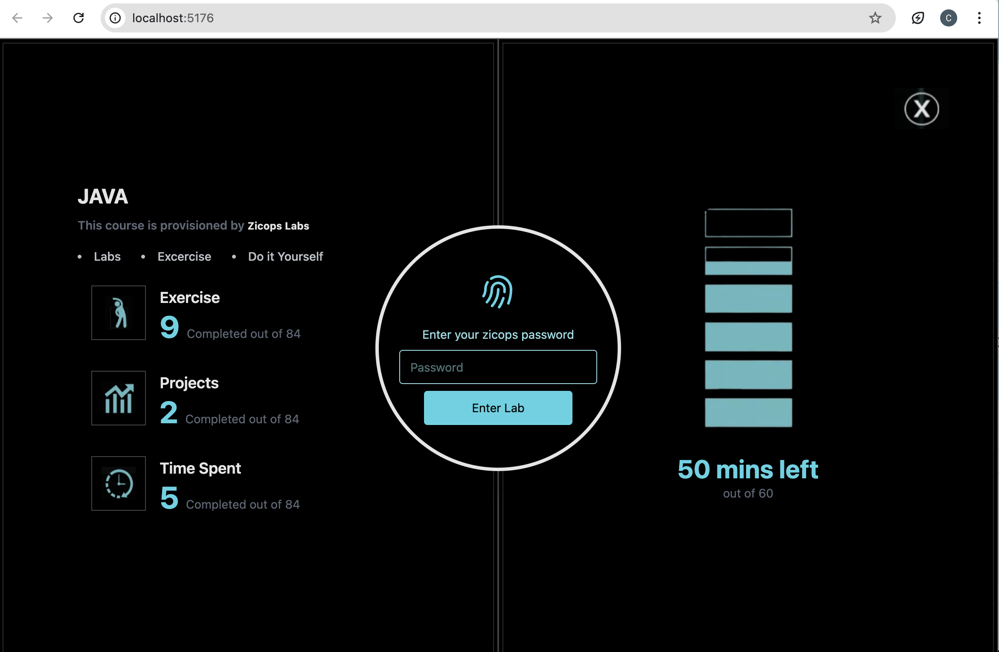
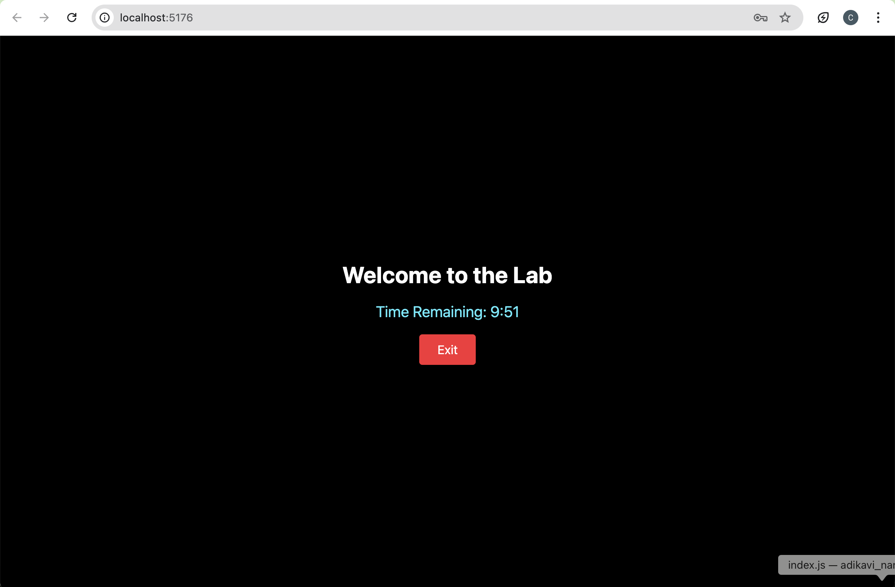
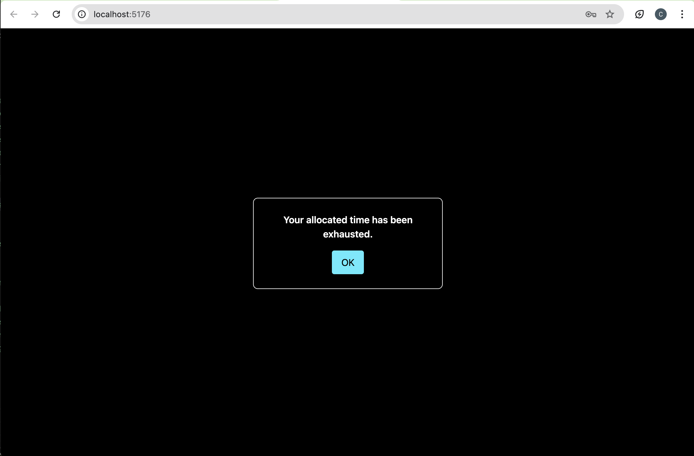

# Lab Access Portal

A React-based Lab Access Portal with sci-fi sliding doors animation, password authentication, and a time-limited lab access feature.

---

## Table of Contents

- [Overview](#overview)  
- [Features](#features)  
- [Screenshots](#screenshots)  
- [Installation](#installation)  
- [Usage](#usage)  
- [Technologies Used](#technologies-used)  
- [License](#license)  

---

## Overview

This project simulates a secure lab environment where users must enter a password to gain access. Upon successful authentication, the doors slide open with a rotating lock animation. Access is limited to a predefined time, after which the user is automatically logged out.

---

## Features

- Password-protected login  
- Incorrect password feedback  
- Sliding door animation with central lock rotation  
- Time-limited lab access  
- Manual exit from the lab  
- Custom alert messages for errors or time exhaustion  

---

## Screenshots

### Login Modal



### Lab Interface with Timer

  

### Custom Alert Example
  


---

## Installation

1. Clone the repository:

```bash
git clone https://github.com/charan-kumar-kamasani/hairscope.git
cd lab-access-portal
